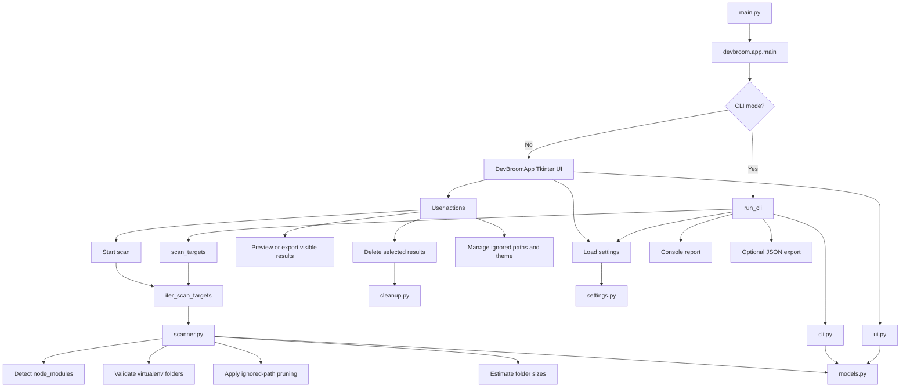

# DevBroom

DevBroom is a small cross-platform utility for reclaiming disk space from development dependencies.

It scans a directory, finds removable folders such as `node_modules` and Python virtual environments, shows their estimated size, and lets you clean them through either:

- a Tkinter desktop UI
- a headless CLI mode for remote or Linux server workflows

## Why This Project Matters

Developer machines and shared workstations tend to accumulate large dependency folders that are safe to rebuild but expensive to keep. DevBroom focuses on that narrow but common cleanup problem: identify heavyweight development artifacts quickly, show the likely reclaimable space, and let the user clean them without touching real application code. The result is a small, practical tool that demonstrates filesystem traversal, cross-platform behavior, GUI/CLI dual-mode design, and safety-oriented cleanup logic in one project.


## Architecture



## What A User Should Know First

- Problem solved: developer machines accumulate large dependency folders that are safe to rebuild but expensive to keep.
- Primary value: quickly find and remove disk-heavy dependency directories without touching application source code.
- Supported targets: `node_modules` and real Python virtual environments.
- Supported environments: Windows and Linux.
- Interfaces: GUI for local desktop use, CLI for headless use.
- Safety posture: conservative detection, ignored-path support, confirmation before deletion, symlink protection, and partial-failure reporting.

## Quick Start

### Windows

Tkinter is usually included with the standard Python installer from python.org.

Run:

```powershell
python main.py
```

### Linux

Some Linux distributions do not include Tkinter by default.

Install Tkinter if needed:

```bash
# Debian / Ubuntu
sudo apt install python3-tk

# Fedora
sudo dnf install python3-tkinter
```

Run:

```bash
python3 main.py
```

## How To Use The Application

### GUI Workflow

1. Start the app with `python main.py` or `python3 main.py`.
2. Choose the root directory you want to scan.
3. Click `Scan`.
4. Review the discovered cleanup candidates.
5. Optionally filter, preview, export, or ignore folders.
6. Select the rows you want to delete.
7. Click `Delete Selected`.

### CLI Workflow

Basic scan:

```bash
python3 main.py --cli --path /path/to/projects
```

Skip saved ignore paths for one run:

```bash
python3 main.py --cli --path /path/to/projects --no-settings-ignores
```

Export results to JSON:

```bash
python3 main.py --cli --path /path/to/projects --json-out scan-report.json
```

CLI output includes:

- matching folders
- estimated sizes
- total reclaimable size
- optional JSON export

## Core Features

- Scan a chosen directory recursively
- Detect `node_modules`
- Detect Python virtual environments such as `venv`, `.venv`, `env`, `.env`, and `virtualenv`
- Show estimated folder sizes before deletion
- Selectively delete only the folders you choose
- Remember last scanned path and preferred theme
- Persist ignored scan paths
- Preview current visible scan results
- Export scan results to JSON or text
- Light mode and dark mode UI

## Detection Rules

DevBroom scans for these targets:

- `node_modules`
- `venv`
- `.venv`
- `env`
- `.env`
- `virtualenv`

Virtual environment candidates are only treated as real Python environments if they contain one of:

- `pyvenv.cfg`
- `Scripts/activate`
- `bin/activate`

This prevents deleting unrelated folders that only happen to use a common virtualenv-like name.

The scanner also skips likely nested package locations such as:

- `site-packages`
- `Lib`
- `lib`
- `node_modules`

That reduces false positives inside installed dependencies.

## Preview And Export

From the GUI:

- `Preview` opens a read-only view of the current visible scan results
- `Export` saves the current visible scan results as `.json` or `.txt`

From the CLI:

- `--json-out scan-report.json` exports JSON
- the console output itself serves as a plain-text preview/report

## Safety Notes

- Deletion is permanent. Items are not moved to Trash or Recycle Bin.
- Symlinked directories are skipped during scanning.
- Symlink targets are not deleted.
- Read-only files are handled during deletion where possible.
- Permission errors and locked files are reported without aborting the entire operation.

## Project Layout

- `main.py`: thin application launcher
- `devbroom/app.py`: app startup and CLI/GUI mode selection
- `devbroom/cli.py`: headless CLI scan/report mode
- `devbroom/ui.py`: Tkinter UI and theme handling
- `devbroom/scanner.py`: target discovery and size calculation
- `devbroom/cleanup.py`: delete helpers and filesystem cleanup
- `devbroom/models.py`: shared constants and `ScanTarget`
- `devbroom/settings.py`: saved preferences and ignored paths
- `tests/test_scanner.py`: scanner tests
- `tests/test_cleanup.py`: cleanup tests
- `tests/test_settings.py`: settings tests
- `tests/test_cli.py`: CLI tests

## Tests

The project includes a strong non-UI unit test suite.

Run the full suite:

```bash
python -m unittest discover -s tests
```

You can also run each file directly:

```bash
python tests/test_scanner.py
python tests/test_cleanup.py
python tests/test_settings.py
python tests/test_cli.py
```

Covered areas:

- target detection
- virtualenv validation
- nested-folder skip behavior
- ignored path handling
- scan cancellation behavior
- safe delete behavior
- read-only file cleanup behavior
- settings persistence
- CLI scan and JSON export behavior
- text report export behavior

The suite is intentionally strongest around non-UI logic. Tkinter widget behavior is still validated manually rather than through UI automation tests.

## Known Limitations

- Scans can be slow on very large directories because folder sizes are calculated recursively.
- Locked files on Windows may still prevent complete deletion.
- Tkinter styling can vary across platforms and desktop environments.
- CLI mode currently scans and reports only; it does not delete folders yet.
- GUI export currently exports visible rows only, which is usually the right behavior after filtering.

## Good Next Modifications

- Add an option to sort by largest folders first immediately after scan completion.
- Add a confirmation detail panel that lists exactly what will be deleted before removal.
- Add delete support to CLI mode with an explicit `--delete` confirmation flag.
- Add CSV export if you want results to be easier to open in spreadsheets.
- Add packaging/install steps once the feature set stabilizes.

## What I Would Not Add Yet

- a database
- background worker processes
- plugin architecture
- heavy UI automation for the current Tkinter surface
- an installer/package distribution workflow before the behavior stabilizes

## Engineering Decisions

- Conservative target detection over aggressive cleanup. Virtual environment folders are validated with marker files instead of trusting names alone, which reduces dangerous false positives.
- Shared scanner and reporting logic across GUI and CLI. This keeps behavior consistent and reduces duplication between local desktop use and headless server workflows.
- Lightweight JSON settings instead of a config framework or database. The project only needs a few persisted values, so a simple file is easier to inspect and maintain.
- Focused non-UI tests over brittle GUI automation. The highest-risk logic lives in scanning, deletion, settings, and reporting, so that is where the test investment provides the most value.
- Intentional feature restraint. The project avoids plugins, background services, and packaging complexity until the core cleanup workflow is more mature.
